# Fun Tuning Comparison Report

Generated on 2025-10-21T03:21:22.939Z

## arena.blackHole

- Generations evaluated: 4
- Starting trial id: arena-blackHole
- Starting average fun score: 0.581
- Best trial id: arena-blackHole.1.3.2.2.3.1
- Average fun score (best trial): 0.649
- Fun score improvement: 0.068 (11.8%)

| Parameter | Before | After |
| --- | --- | --- |
| gravityStrength | 800000 | 800000 |
| gravityFalloff | 140 | 70 |
| radius | 90 | 90 |

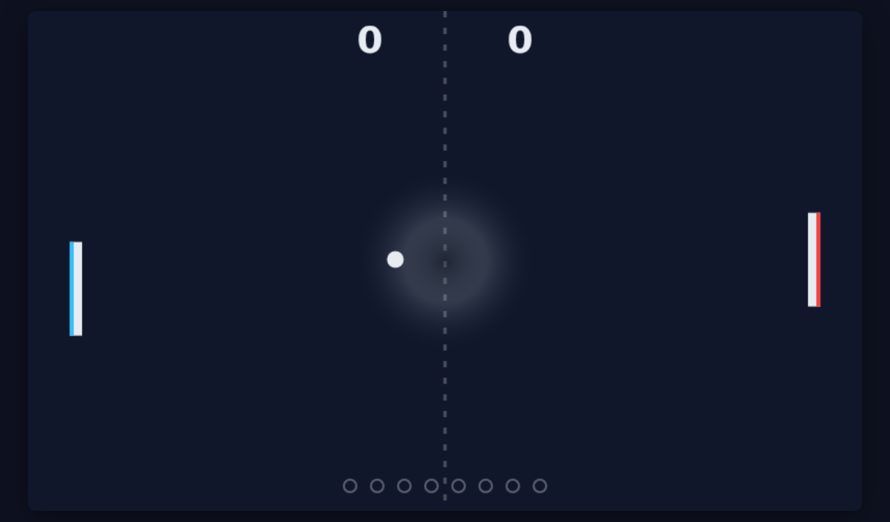

## arena.blackMole

- Generations evaluated: 4
- Starting trial id: arena-blackMole
- Starting average fun score: 0.565
- Best trial id: arena-blackMole.1.3.2.2.3.2
- Average fun score (best trial): 0.643
- Fun score improvement: 0.078 (13.7%)

| Parameter | Before | After |
| --- | --- | --- |
| gravityStrength | 4600000 | 4600000 |
| gravityFalloff | 118 | 188.8 |
| radius | 44 | 29.333333 |
| wanderWidthPercentage | 0.4 | 0.4 |
| pauseDuration | 1.25 | 1.25 |
| wanderSpeed | 110 | 123.75 |

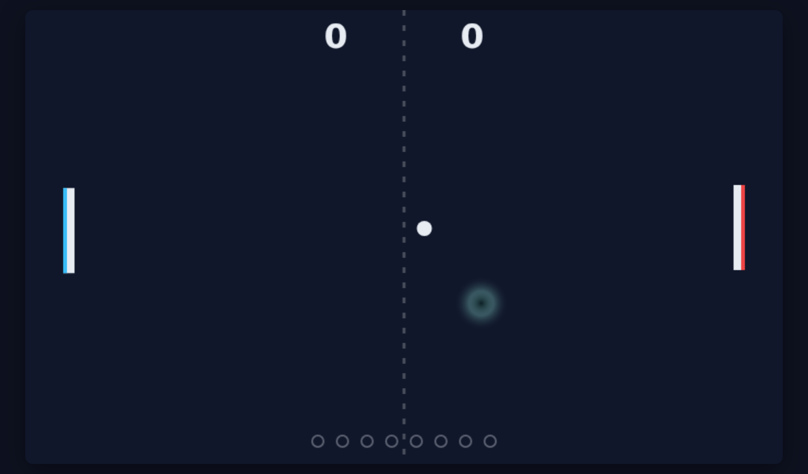

## arena.ceres

- Generations evaluated: 4
- Starting trial id: arena-ceres
- Starting average fun score: 0.610
- Best trial id: arena-ceres.1.3.2.1.3.2
- Average fun score (best trial): 0.628
- Fun score improvement: 0.018 (3.0%)

| Parameter | Before | After |
| --- | --- | --- |
| gravityStrength | 5600000 | 4480000 |
| gravityFalloff | 128 | 128 |
| radius | 62 | 124 |
| wanderSpeed | 180 | 106.666667 |

## arena.divots

- Generations evaluated: 4
- Starting trial id: arena-divots
- Starting average fun score: 0.570
- Best trial id: arena-divots.1.2.2.2.3.3
- Average fun score (best trial): 0.645
- Fun score improvement: 0.076 (13.3%)

| Parameter | Before | After |
| --- | --- | --- |
| gravityStrength | 5200000 | 3466666.666667 |
| gravityFalloff | 126 | 126 |
| radius | 38 | 38 |
| maxDivots | 14 | 14 |
| spawnMargin | 64 | 102.4 |

## arena.drinkMe

- Generations evaluated: 4
- Starting trial id: arena-drinkMe
- Starting average fun score: 0.602
- Best trial id: arena-drinkMe.1.1.2.2.3.1
- Average fun score (best trial): 0.626
- Fun score improvement: 0.024 (4.0%)

| Parameter | Before | After |
| --- | --- | --- |
| gravityStrength | 0 | 0 |
| gravityFalloff | 0 | 0 |
| radius | 20 | 25 |
| objectRadius | 18 | 12 |
| spawnCount | 4 | 4 |
| shrinkAmount | 28 | 28 |

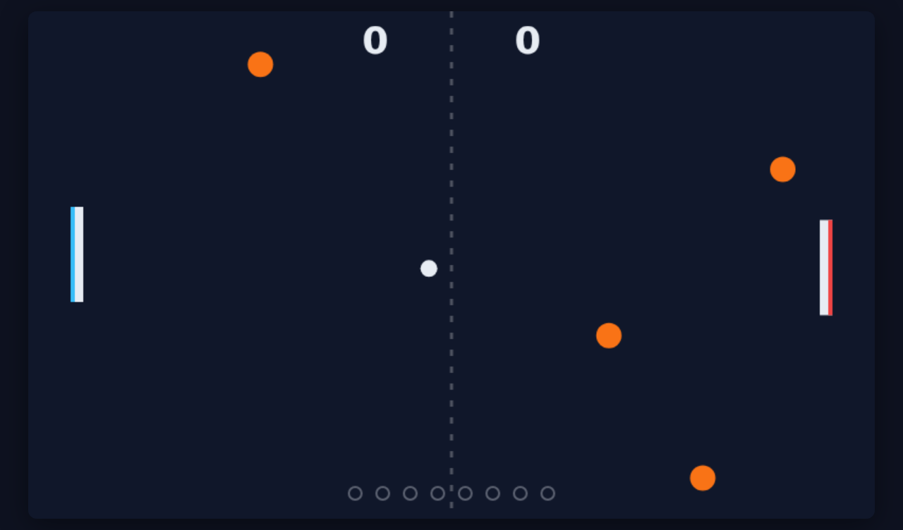

## arena.fogOfWar

- Generations evaluated: 4
- Starting trial id: arena-fogOfWar
- Starting average fun score: 0.611
- Best trial id: arena-fogOfWar.1.2.2.3.3.2
- Average fun score (best trial): 0.626
- Fun score improvement: 0.015 (2.4%)

| Parameter | Before | After |
| --- | --- | --- |
| gravityStrength | 0 | 0 |
| gravityFalloff | 0 | 0 |
| radius | 0 | 0 |
| fogExpansionSpeed | 220 | 146.666667 |
| fogMaxRadius | 420 | 420 |
| fogMaxOpacity | 0.85 | 0.85 |

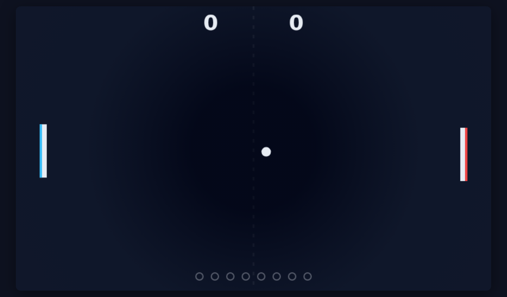

## arena.gopher

- Generations evaluated: 4
- Starting trial id: arena-gopher
- Starting average fun score: 0.582
- Best trial id: arena-gopher.1.1.2.3.3.2
- Average fun score (best trial): 0.610
- Fun score improvement: 0.028 (4.8%)

| Parameter | Before | After |
| --- | --- | --- |
| gravityStrength | -6200000 | -8266666.666667 |
| gravityFalloff | 45 | 45 |
| radius | 53 | 53 |
| wanderWidthPercentage | 0.45 | 0.5625 |
| pauseDuration | 1.1 | 1.1 |
| wanderSpeed | 125 | 250 |

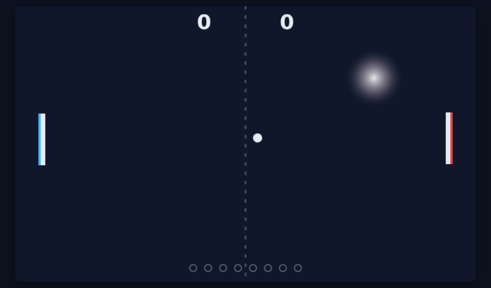

## arena.ireland

- Generations evaluated: 4
- Starting trial id: arena-ireland
- Starting average fun score: 0.612
- Best trial id: arena-ireland.1.3.2.3.3.1
- Average fun score (best trial): 0.649
- Fun score improvement: 0.037 (6.0%)

| Parameter | Before | After |
| --- | --- | --- |
| gravityStrength | -1200000 | -1200000 |
| gravityFalloff | 7 | 7 |
| radius | 56 | 37.333333 |
| wellCount | 16 | 12.8 |
| minGravityStrength | 1800000 | 1600000 |
| maxGravityStrength | 6200000 | 3100000 |
| minGravityFalloff | 95 | 95 |
| maxGravityFalloff | 161 | 161 |
| minRadius | 24 | 24 |
| maxRadius | 86 | 86 |

## arena.jupiter

- Generations evaluated: 4
- Starting trial id: arena-jupiter
- Starting average fun score: 0.595
- Best trial id: arena-jupiter.1.1.2.2.3.3
- Average fun score (best trial): 0.631
- Fun score improvement: 0.036 (6.1%)

| Parameter | Before | After |
| --- | --- | --- |
| gravityStrength | 6800000 | 6800000 |
| gravityFalloff | 112 | 149.333333 |
| radius | 74 | 74 |
| wanderWidthPercentage | 0.7 | 0.875 |
| wanderSpeed | 0.55 | 0.55 |

## arena.madHatter

- Generations evaluated: 4
- Starting trial id: arena-madHatter
- Starting average fun score: 0.616
- Best trial id: arena-madHatter.1.1.2.1.3.2
- Average fun score (best trial): 0.649
- Fun score improvement: 0.034 (5.4%)

| Parameter | Before | After |
| --- | --- | --- |
| gravityStrength | 0 | 0 |
| gravityFalloff | 0 | 0 |
| radius | 0 | 0 |

## arena.minesweeper

- Generations evaluated: 4
- Starting trial id: arena-minesweeper
- Starting average fun score: 0.593
- Best trial id: arena-minesweeper.1.2.2.3.3.3
- Average fun score (best trial): 0.632
- Fun score improvement: 0.039 (6.6%)

| Parameter | Before | After |
| --- | --- | --- |
| gravityStrength | 0 | 0 |
| gravityFalloff | 0 | 0 |
| radius | 0 | 0 |
| gridSpacing | 85 | 68 |
| squareSize | 34 | 34 |
| rows | 5 | 6.25 |
| columns | 4 | 3 |

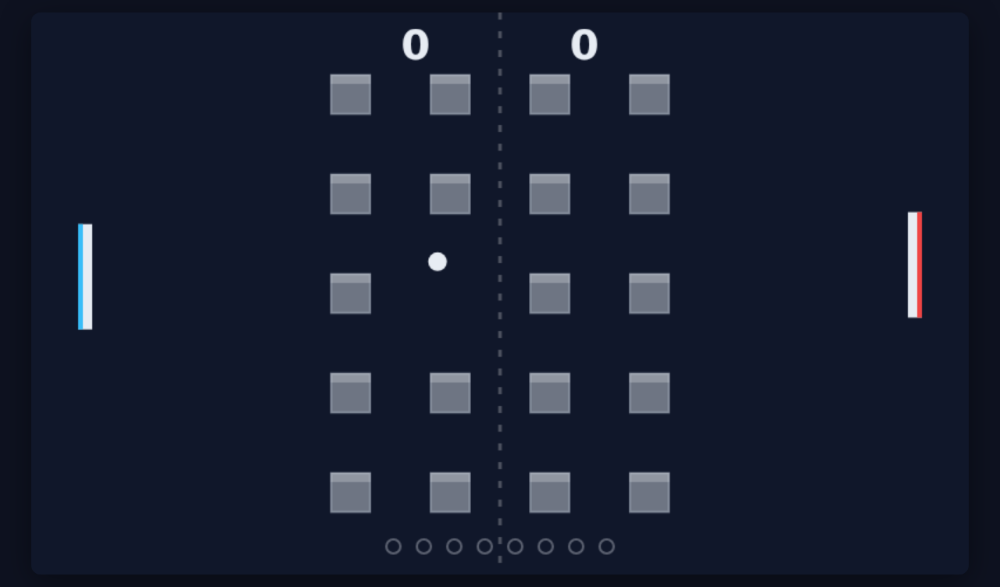

## arena.russianRoulette

- Generations evaluated: 4
- Starting trial id: arena-russianRoulette
- Starting average fun score: 0.625
- Best trial id: arena-russianRoulette.1.2.2.1.3.2
- Average fun score (best trial): 0.633
- Fun score improvement: 0.009 (1.4%)

| Parameter | Before | After |
| --- | --- | --- |
| gravityStrength | 0 | 0 |
| gravityFalloff | 0 | 0 |
| radius | 0 | 0 |
| illusionFadeDistance | 140 | 124.444444 |
| illusionFadeSpeed | 6 | 6 |

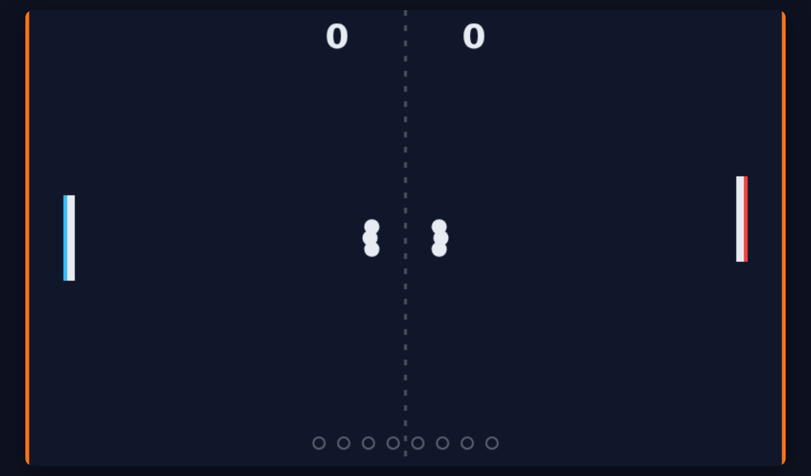

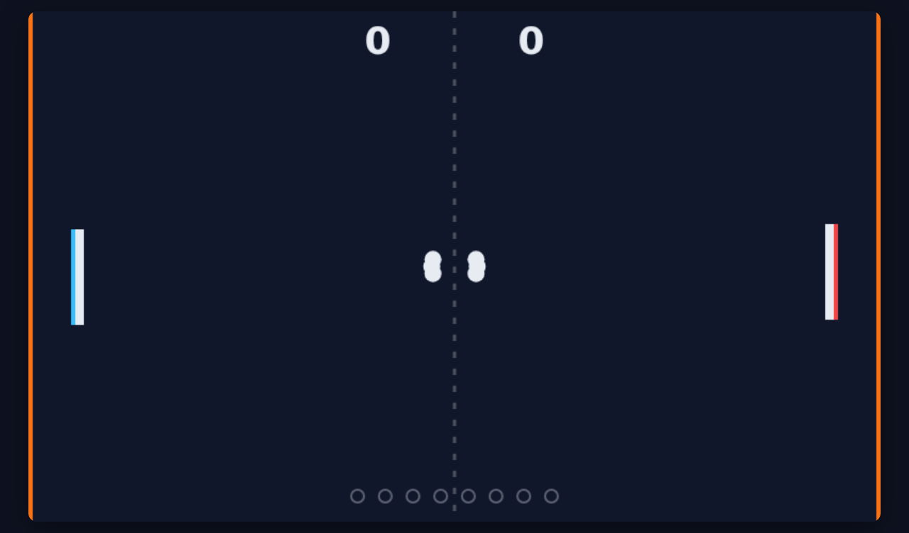

## arena.searchLight

- Generations evaluated: 4
- Starting trial id: arena-searchLight
- Starting average fun score: 0.578
- Best trial id: arena-searchLight.1.2.2.3.3.1
- Average fun score (best trial): 0.635
- Fun score improvement: 0.057 (9.8%)

| Parameter | Before | After |
| --- | --- | --- |
| gravityStrength | 0 | 0 |
| gravityFalloff | 0 | 0 |
| radius | 0 | 0 |
| coneLength | 240 | 240 |
| coneWidth | 220 | 220 |
| ballBrightness | 1.35 | 1.51875 |

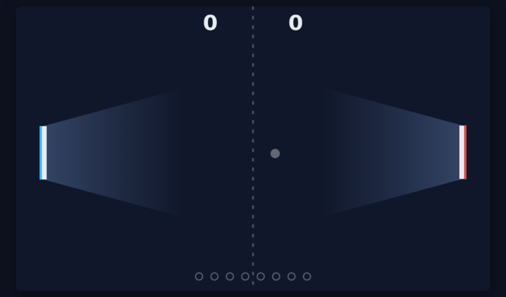

## arena.secondChances

- Generations evaluated: 4
- Starting trial id: arena-secondChances
- Starting average fun score: 0.627
- Best trial id: arena-secondChances.1.2.2.3.3.2
- Average fun score (best trial): 0.625
- Fun score improvement: -0.002 (-0.3%)

| Parameter | Before | After |
| --- | --- | --- |
| gravityStrength | 0 | 0 |
| gravityFalloff | 0 | 0 |
| radius | 0 | 0 |
| maxHits | 2 | 1.777778 |

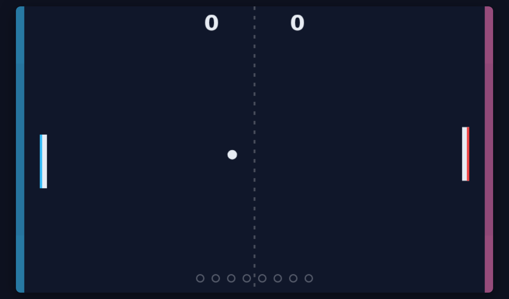

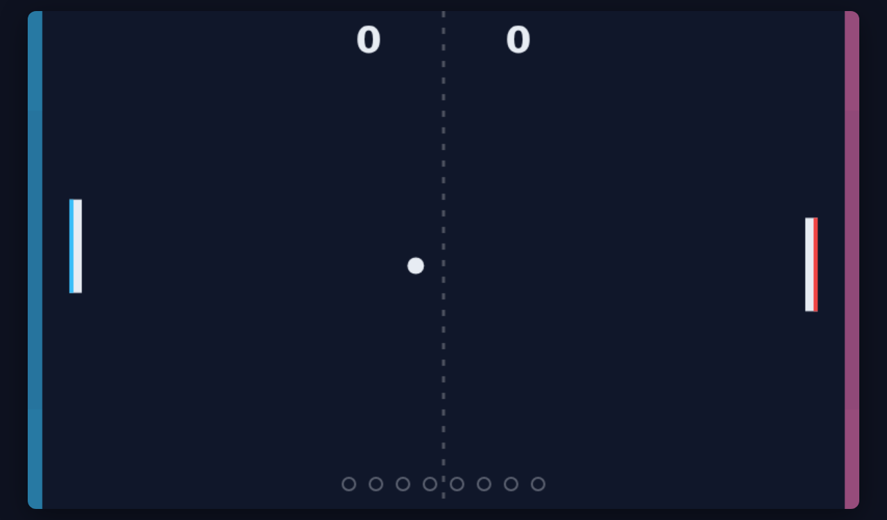

## arena.spaceInvaders

- Generations evaluated: 4
- Starting trial id: arena-spaceInvaders
- Starting average fun score: 0.601
- Best trial id: arena-spaceInvaders.1.3.2.2.3.1
- Average fun score (best trial): 0.626
- Fun score improvement: 0.025 (4.2%)

| Parameter | Before | After |
| --- | --- | --- |
| gravityStrength | 0 | 0 |
| gravityFalloff | 0 | 0 |
| radius | 0 | 0 |
| barricadeHealth | 3 | 1.333333 |
| barricadeCount | 4 | 4 |
| barricadeSpacing | 26 | 26 |
| barricadeDistance | 120 | 120 |

## arena.superMassive

- Generations evaluated: 4
- Starting trial id: arena-superMassive
- Starting average fun score: 0.623
- Best trial id: arena-superMassive.1.3.2.2.3.2
- Average fun score (best trial): 0.636
- Fun score improvement: 0.013 (2.1%)

| Parameter | Before | After |
| --- | --- | --- |
| gravityStrength | 3200000 | 2000000 |
| gravityFalloff | 141 | 188 |
| radius | 72 | 72 |

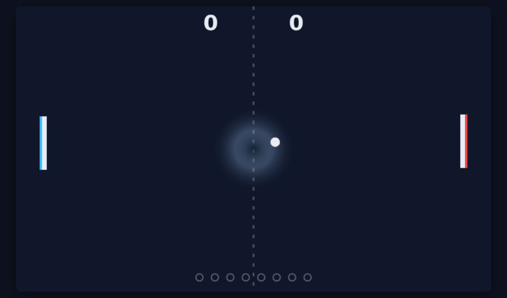

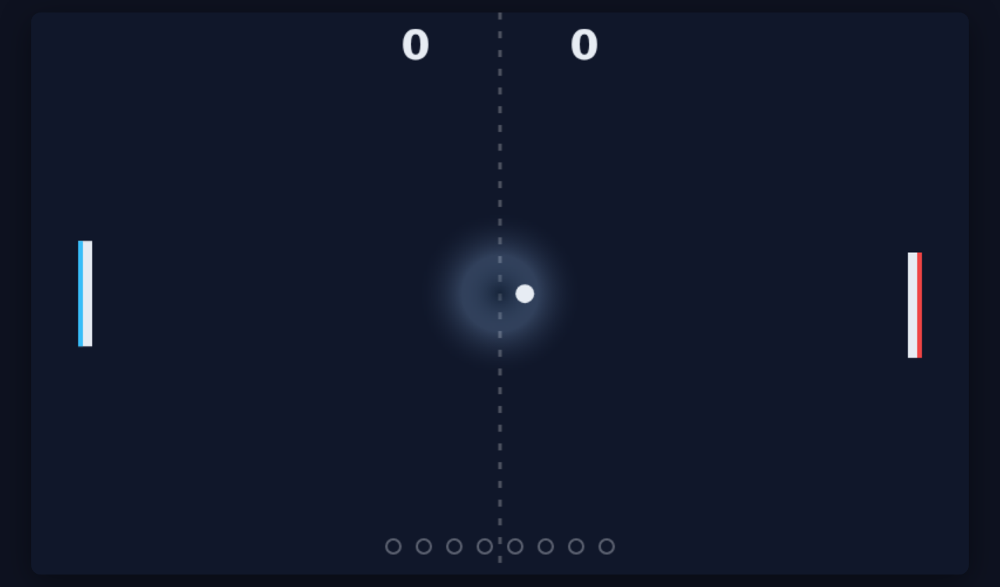

## arena.teaParty

- Generations evaluated: 4
- Starting trial id: arena-teaParty
- Starting average fun score: 0.600
- Best trial id: arena-teaParty.1.2.2.3.3.1
- Average fun score (best trial): 0.640
- Fun score improvement: 0.040 (6.7%)

| Parameter | Before | After |
| --- | --- | --- |
| gravityStrength | 0 | 0 |
| gravityFalloff | 0 | 0 |
| radius | 20 | 16 |
| objectRadius | 20 | 22.5 |
| spawnCount | 3 | 1.5 |
| shrinkAmount | 24 | 24 |
| growAmount | 20 | 20 |

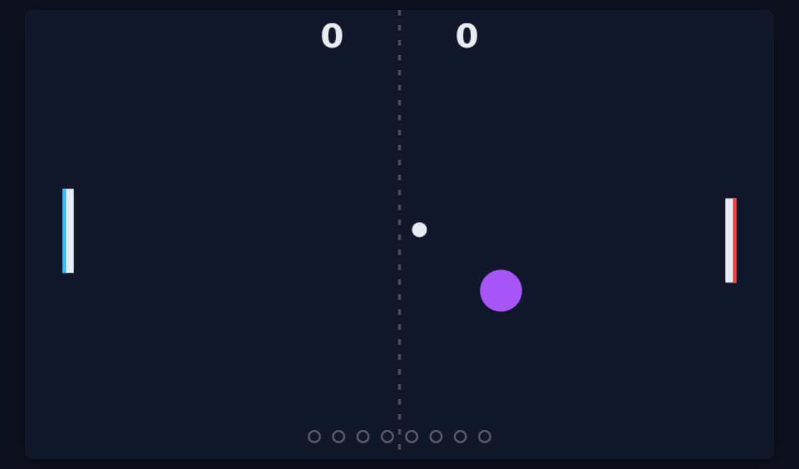

## arena.threeBodyProblem

- Generations evaluated: 4
- Starting trial id: arena-threeBodyProblem
- Starting average fun score: 0.603
- Best trial id: arena-threeBodyProblem.1.3.2.3.3.2
- Average fun score (best trial): 0.644
- Fun score improvement: 0.042 (6.9%)

| Parameter | Before | After |
| --- | --- | --- |
| gravityStrength | 6200000 | 6200000 |
| gravityFalloff | 126 | 126 |
| radius | 72 | 72 |
| orbitGravityStrength | 4200000 | 5250000 |
| orbitGravityFalloff | 94 | 94 |
| orbitRadius | 38 | 42.75 |
| orbitDistance | 180 | 120 |
| orbitSpeed | 0.9 | 1.8 |

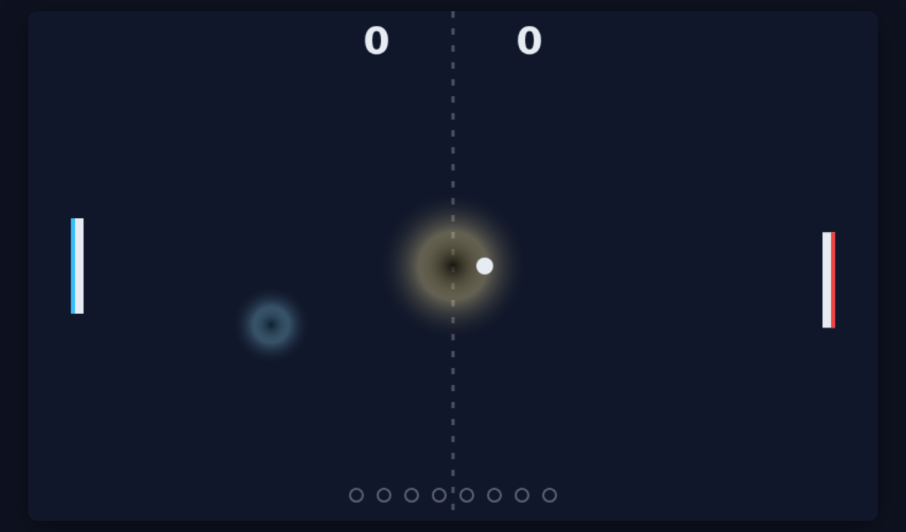

## arena.vortex

- Generations evaluated: 4
- Starting trial id: arena-vortex
- Starting average fun score: 0.614
- Best trial id: arena-vortex.1.3.2.2.3.1
- Average fun score (best trial): 0.628
- Fun score improvement: 0.014 (2.3%)

| Parameter | Before | After |
| --- | --- | --- |
| gravityStrength | 0 | 0 |
| gravityFalloff | 0 | 0 |
| radius | 0 | 0 |
| portalPairs | 2 | 1.6 |
| portalRadius | 34 | 30.222222 |
| portalMargin | 96 | 144 |
| portalCooldown | 0.18 | 0.18 |
| portalRotationSpeed | 3.14 | 3.14 |

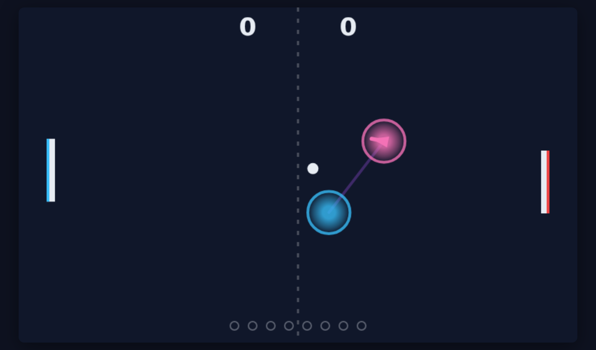

## arena.whiteDwarf

- Generations evaluated: 4
- Starting trial id: arena-whiteDwarf
- Starting average fun score: 0.586
- Best trial id: arena-whiteDwarf.1.2.2.1.3.1
- Average fun score (best trial): 0.631
- Fun score improvement: 0.044 (7.6%)

| Parameter | Before | After |
| --- | --- | --- |
| gravityStrength | 7200000 | 9000000 |
| gravityFalloff | 77 | 115.5 |
| radius | 26 | 14.625 |

## arena.wonderland

- Generations evaluated: 4
- Starting trial id: arena-wonderland
- Starting average fun score: 0.621
- Best trial id: arena-wonderland.1.3.2.1.3.3
- Average fun score (best trial): 0.622
- Fun score improvement: 0.000 (0.1%)

| Parameter | Before | After |
| --- | --- | --- |
| gravityStrength | 0 | 0 |
| gravityFalloff | 0 | 0 |
| radius | 0 | 0 |
| snowflakeCount | 200 | 200 |
| snowflakeSize | 8 | 8 |
| snowflakeSpeed | 220 | 330 |
| snowOpacity | 0.88 | 1.1 |

## arena.wormhole

- Generations evaluated: 4
- Starting trial id: arena-wormhole
- Starting average fun score: 0.559
- Best trial id: arena-wormhole.1.1.2.2.3.3
- Average fun score (best trial): 0.628
- Fun score improvement: 0.068 (12.2%)

| Parameter | Before | After |
| --- | --- | --- |
| gravityStrength | 0 | 0 |
| gravityFalloff | 0 | 0 |
| radius | 0 | 0 |
| portalPairs | 2 | 2 |
| portalRadius | 34 | 22.666667 |
| portalMargin | 92 | 92 |
| portalCooldown | 0.18 | 0.18 |

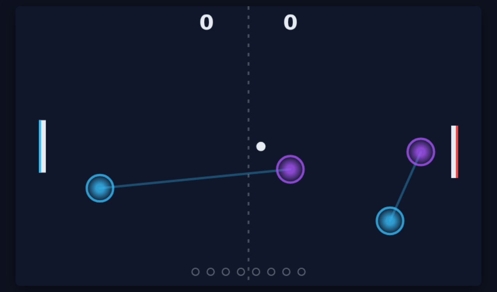

## ball.bumShuffle

- Generations evaluated: 4
- Starting trial id: ball-bumShuffle
- Starting average fun score: 0.582
- Best trial id: ball-bumShuffle.1.2.2.1.3.3
- Average fun score (best trial): 0.629
- Fun score improvement: 0.047 (8.0%)

| Parameter | Before | After |
| --- | --- | --- |
| trailLength | 320 | 426.666667 |

## ball.kite

- Generations evaluated: 4
- Starting trial id: ball-kite
- Starting average fun score: 0.598
- Best trial id: ball-kite.1.3.2.3.3.1
- Average fun score (best trial): 0.623
- Fun score improvement: 0.025 (4.2%)

| Parameter | Before | After |
| --- | --- | --- |
| tailLength | 28 | 8.296296 |

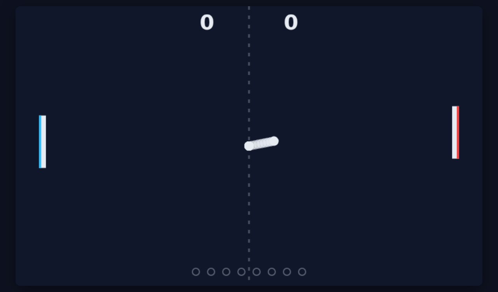

## ball.meteor

- Generations evaluated: 4
- Starting trial id: ball-meteor
- Starting average fun score: 0.555
- Best trial id: ball-meteor.1.1.2.2.3.2
- Average fun score (best trial): 0.632
- Fun score improvement: 0.077 (13.9%)

| Parameter | Before | After |
| --- | --- | --- |
| startRadius | 18 | 54 |
| minRadius | 5 | 5 |
| shrinkRate | 0.02 | 0.014222 |

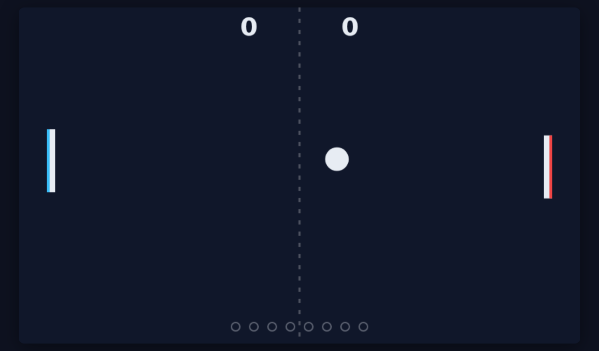

## ball.pollok

- Generations evaluated: 4
- Starting trial id: ball-pollok
- Starting average fun score: 0.587
- Best trial id: ball-pollok.1.3.2.2.3.2
- Average fun score (best trial): 0.624
- Fun score improvement: 0.037 (6.4%)

| Parameter | Before | After |
| --- | --- | --- |
| trailLength | 1200 | 444.444444 |

## ball.snowball

- Generations evaluated: 4
- Starting trial id: ball-snowball
- Starting average fun score: 0.613
- Best trial id: ball-snowball.1.3.2.3.3.3
- Average fun score (best trial): 0.692
- Fun score improvement: 0.079 (12.9%)

| Parameter | Before | After |
| --- | --- | --- |
| minRadius | 4 | 4 |
| maxRadius | 18 | 33.75 |
| growthRate | 0.02 | 0.0225 |

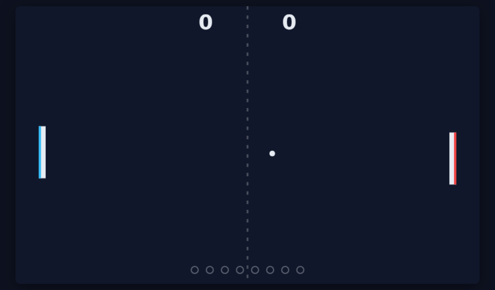

## paddle.angry

- Generations evaluated: 4
- Starting trial id: paddle-angry
- Starting average fun score: 0.602
- Best trial id: paddle-angry.1.1.2.1.3.3
- Average fun score (best trial): 0.684
- Fun score improvement: 0.082 (13.5%)

| Parameter | Before | After |
| --- | --- | --- |
| paddleSizeMultiplier | 1 | 3 |
| stretchSpeed | 200 | 225 |
| maxStretch | 54 | 67.5 |
| releaseSpeed | 380 | 380 |
| moveSpeedMultiplier | 0.55 | 0.55 |

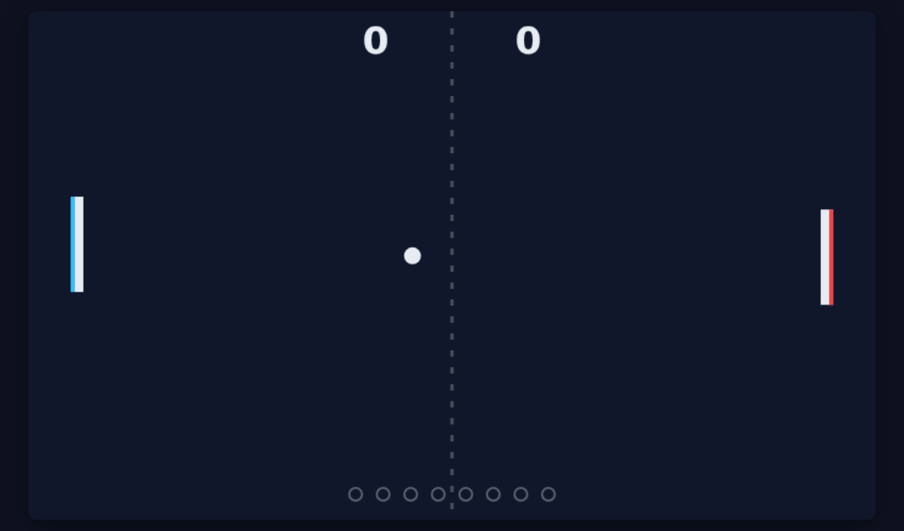

## paddle.apparition

- Generations evaluated: 4
- Starting trial id: paddle-apparition
- Starting average fun score: 0.592
- Best trial id: paddle-apparition.1.1.2.1.3.3
- Average fun score (best trial): 0.676
- Fun score improvement: 0.083 (14.1%)

| Parameter | Before | After |
| --- | --- | --- |
| minOpacity | 0.05 | 0.044444 |
| fadeDuration | 0.8 | 0.8 |
| visibleHoldDuration | 3.2 | 3.2 |
| hiddenHoldDuration | 1.4 | 1.4 |
| paddleSizeMultiplier | 1 | 3.75 |

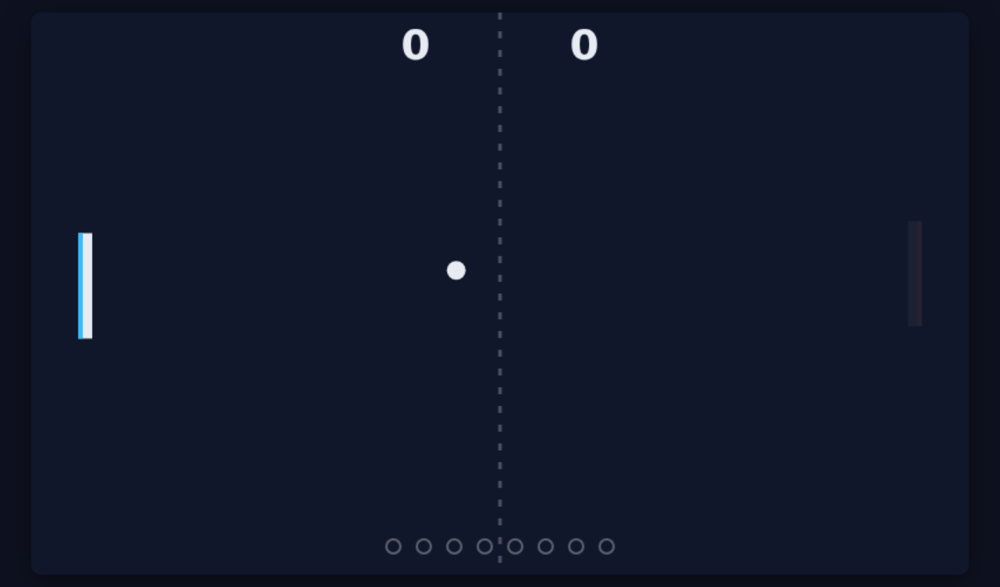

## paddle.bendy

- Generations evaluated: 4
- Starting trial id: paddle-bendy
- Starting average fun score: 0.592
- Best trial id: paddle-bendy.1.1.2.3.3.3
- Average fun score (best trial): 0.648
- Fun score improvement: 0.056 (9.4%)

| Parameter | Before | After |
| --- | --- | --- |
| paddleSizeMultiplier | 1 | 2.8125 |
| maxOffset | 8 | 8 |
| oscillationSpeed | 5 | 5 |
| speedForMaxBend | 420 | 280 |

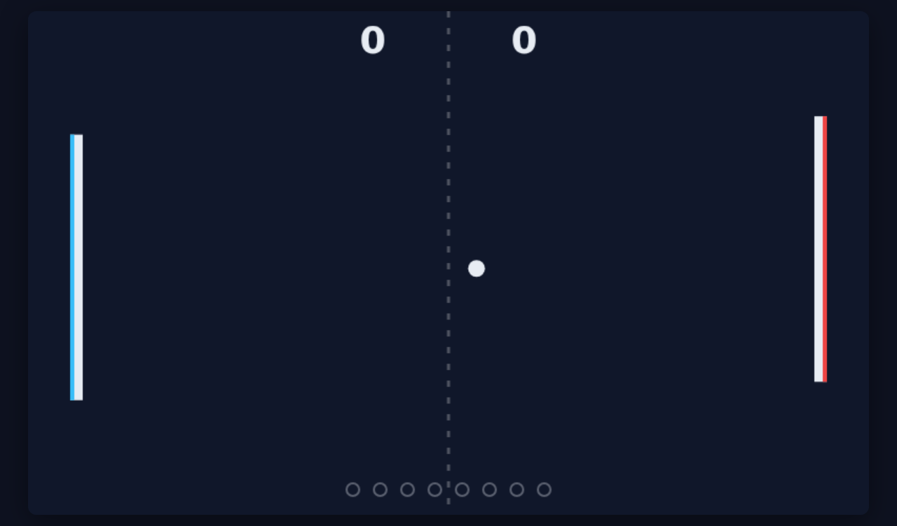

## paddle.brokePhysics

- Generations evaluated: 4
- Starting trial id: paddle-brokePhysics
- Starting average fun score: 0.573
- Best trial id: paddle-brokePhysics.1.1.2.2.3.3
- Average fun score (best trial): 0.686
- Fun score improvement: 0.113 (19.7%)

| Parameter | Before | After |
| --- | --- | --- |
| centerAngle | 1.2 | 0.533333 |
| edgeAngle | 0.05 | 0.075 |
| paddleSizeMultiplier | 1 | 0.8 |

## paddle.buckTooth

- Generations evaluated: 4
- Starting trial id: paddle-buckTooth
- Starting average fun score: 0.559
- Best trial id: paddle-buckTooth.1.2.2.3.3.3
- Average fun score (best trial): 0.663
- Fun score improvement: 0.104 (18.7%)

| Parameter | Before | After |
| --- | --- | --- |
| gapSize | 18 | 18 |
| paddleSizeMultiplier | 1 | 4.21875 |

## paddle.bungee

- Generations evaluated: 4
- Starting trial id: paddle-bungee
- Starting average fun score: 0.592
- Best trial id: paddle-bungee.1.1.2.1.3.2
- Average fun score (best trial): 0.659
- Fun score improvement: 0.067 (11.3%)

| Parameter | Before | After |
| --- | --- | --- |
| paddleSizeMultiplier | 1 | 3 |
| returnSpeed | 240 | 240 |

## paddle.charlotte

- Generations evaluated: 4
- Starting trial id: paddle-charlotte
- Starting average fun score: 0.409
- Best trial id: paddle-charlotte.1.2.2.2.3.1
- Average fun score (best trial): 0.420
- Fun score improvement: 0.011 (2.6%)

| Parameter | Before | After |
| --- | --- | --- |
| paddleSizeMultiplier | 1 | 1 |
| webWidthMultiplier | 0.5 | 1 |
| maxWebLengthMultiplier | 1 | 0.474074 |

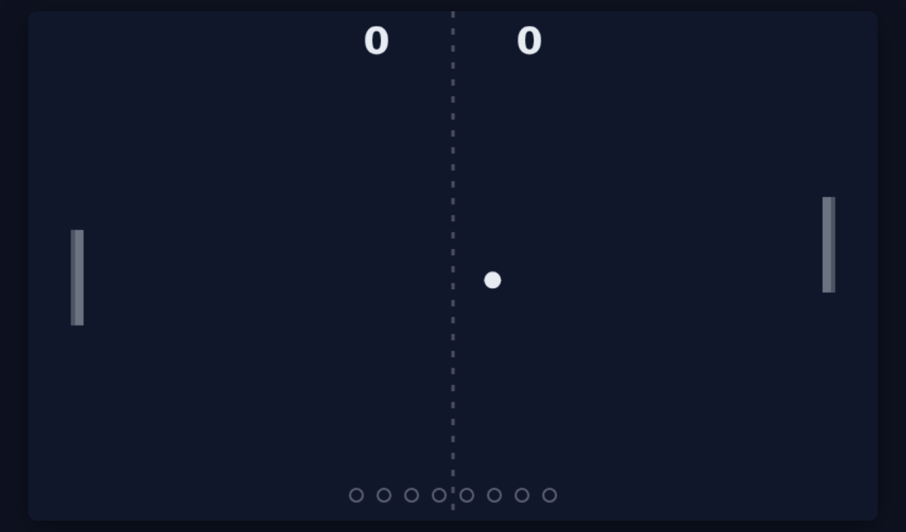

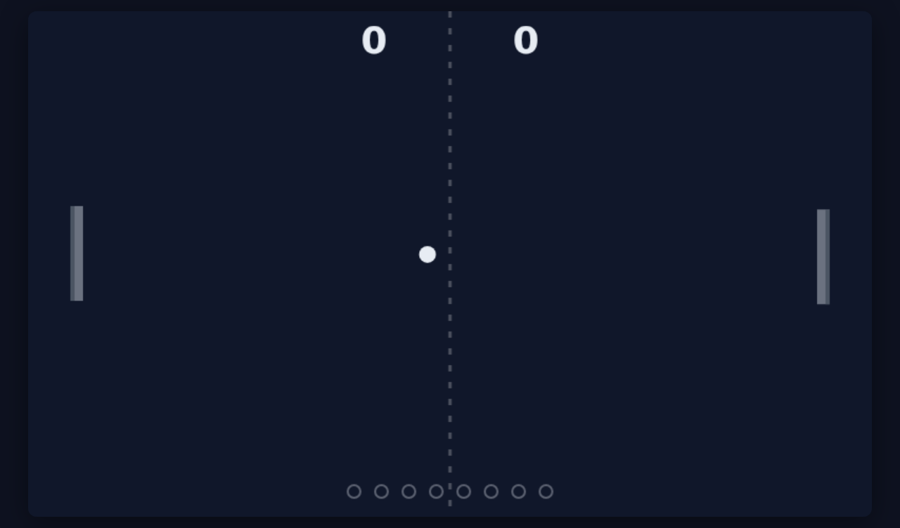

## paddle.chilly

- Generations evaluated: 4
- Starting trial id: paddle-chilly
- Starting average fun score: 0.611
- Best trial id: paddle-chilly.1.1.2.1.3.3
- Average fun score (best trial): 0.683
- Fun score improvement: 0.072 (11.7%)

| Parameter | Before | After |
| --- | --- | --- |
| startingHeight | 132 | 264 |
| shrinkAmount | 6 | 6 |
| minimumHeight | 78 | 69.333333 |
| paddleSizeMultiplier | 1 | 1.875 |

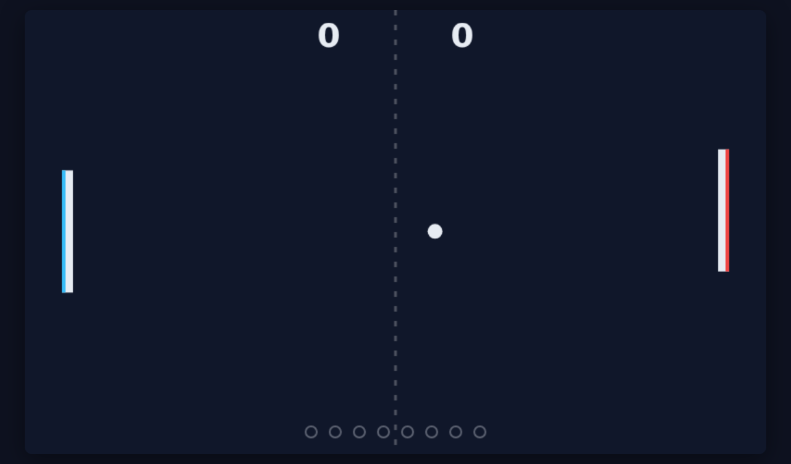

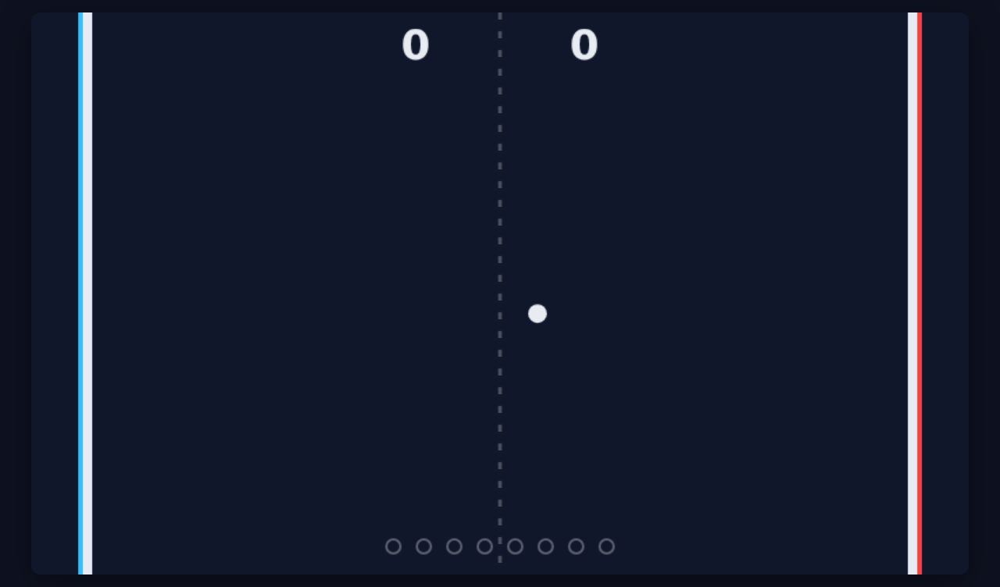

## paddle.crabby

- Generations evaluated: 4
- Starting trial id: paddle-crabby
- Starting average fun score: 0.531
- Best trial id: paddle-crabby.1.1.2.1.3.1
- Average fun score (best trial): 0.639
- Fun score improvement: 0.108 (20.3%)

| Parameter | Before | After |
| --- | --- | --- |
| gapSize | 12 | 12 |
| clawRatio | 0.65 | 0.65 |
| clawAdvantage | 0.3 | 0.3375 |
| swapSides | false | false |
| paddleSizeMultiplier | 1 | 2 |

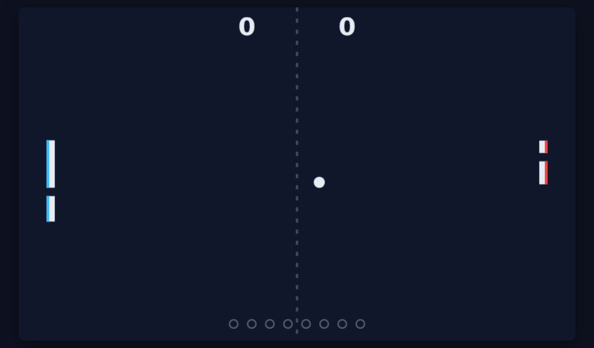

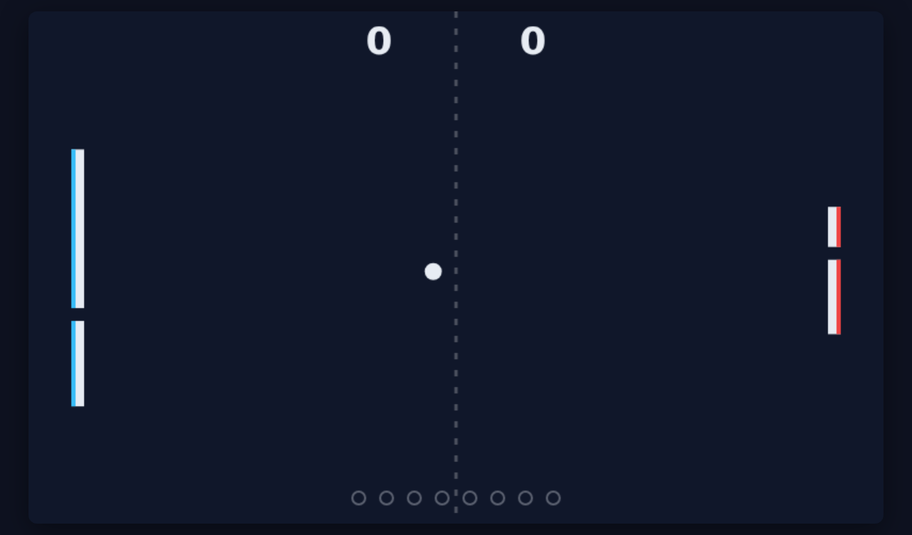

## paddle.dizzy

- Generations evaluated: 4
- Starting trial id: paddle-dizzy
- Starting average fun score: 0.584
- Best trial id: paddle-dizzy.1.1.2.1.3.1
- Average fun score (best trial): 0.668
- Fun score improvement: 0.084 (14.3%)

| Parameter | Before | After |
| --- | --- | --- |
| paddleSizeMultiplier | 1 | 4.21875 |

## paddle.dundee

- Generations evaluated: 4
- Starting trial id: paddle-dundee
- Starting average fun score: 0.575
- Best trial id: paddle-dundee.1.1.2.1.3.1
- Average fun score (best trial): 0.628
- Fun score improvement: 0.053 (9.2%)

| Parameter | Before | After |
| --- | --- | --- |
| paddleSizeMultiplier | 1 | 1 |
| baseSpeed | 220 | 110 |
| acceleration | 520 | 346.666667 |
| maxSpeed | 560 | 700 |

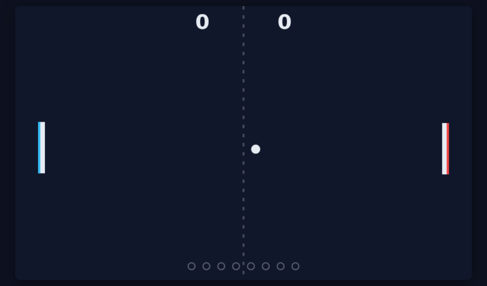

## paddle.foosball

- Generations evaluated: 4
- Starting trial id: paddle-foosball
- Starting average fun score: 0.571
- Best trial id: paddle-foosball.1.1.2.1.3.2
- Average fun score (best trial): 0.687
- Fun score improvement: 0.116 (20.4%)

| Parameter | Before | After |
| --- | --- | --- |
| gapSize | 10 | 8 |
| paddleSizeMultiplier | 1 | 3.375 |

## paddle.frisbee

- Generations evaluated: 4
- Starting trial id: paddle-frisbee
- Starting average fun score: 0.591
- Best trial id: paddle-frisbee.1.2.2.2.3.1
- Average fun score (best trial): 0.645
- Fun score improvement: 0.055 (9.2%)

| Parameter | Before | After |
| --- | --- | --- |
| paddleSizeMultiplier | 1 | 1.5 |
| throwSpeed | 560 | 504 |

## paddle.hadron

- Generations evaluated: 4
- Starting trial id: paddle-hadron
- Starting average fun score: 0.659
- Best trial id: paddle-hadron.1.1.2.2.3.2
- Average fun score (best trial): 0.723
- Fun score improvement: 0.064 (9.7%)

| Parameter | Before | After |
| --- | --- | --- |
| splitAngle | 0.35 | 0.093333 |
| paddleSizeMultiplier | 3 | 3.375 |

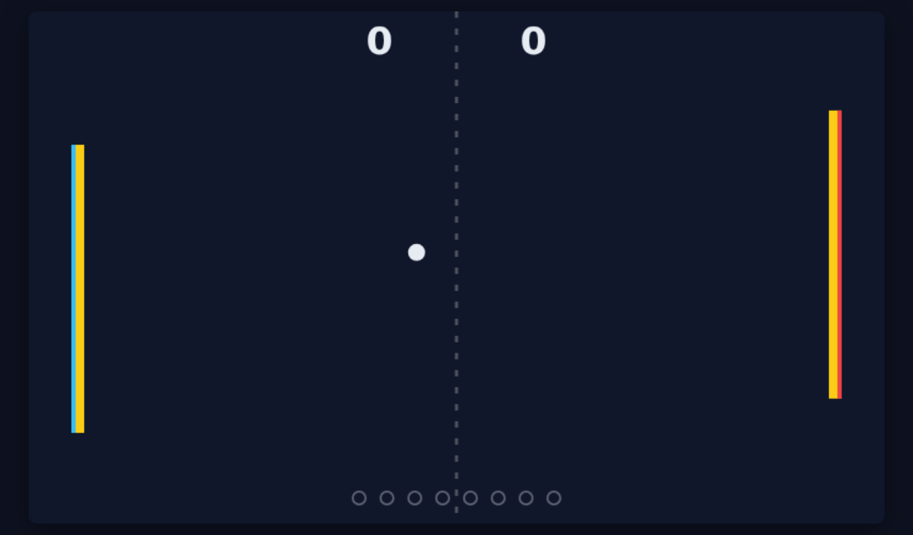

## paddle.inchworm

- Generations evaluated: 4
- Starting trial id: paddle-inchworm
- Starting average fun score: 0.595
- Best trial id: paddle-inchworm.1.1.2.1.3.1
- Average fun score (best trial): 0.671
- Fun score improvement: 0.076 (12.7%)

| Parameter | Before | After |
| --- | --- | --- |
| paddleSizeMultiplier | 1 | 3.375 |
| shrinkAmount | 28 | 28 |
| minimumHeight | 48 | 48 |
| shrinkSpeed | 220 | 220 |
| extendSpeed | 260 | 260 |

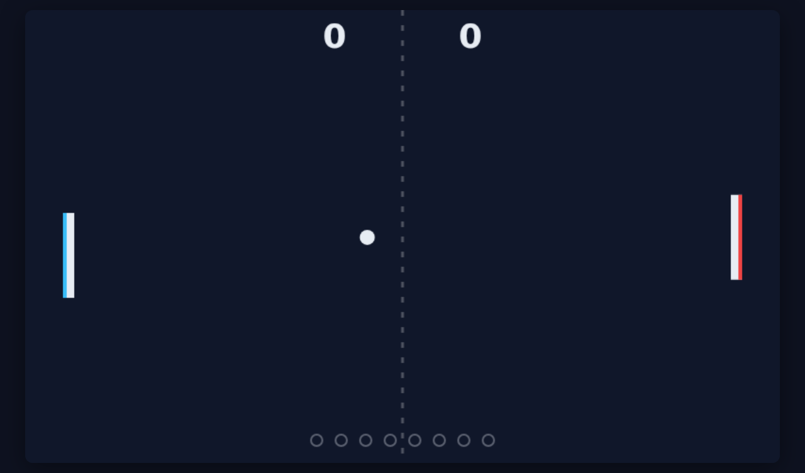

## paddle.missileCommander

- Generations evaluated: 4
- Starting trial id: paddle-missileCommander
- Starting average fun score: 0.594
- Best trial id: paddle-missileCommander.1.3.2.3.3.3
- Average fun score (best trial): 0.646
- Fun score improvement: 0.052 (8.7%)

| Parameter | Before | After |
| --- | --- | --- |
| paddleSizeMultiplier | 1 | 2 |
| launchSpeed | 520 | 520 |
| cooldown | 0.8 | 0.8 |
| missileHeight | 68 | 45.333333 |
| missileLifetime | 1.6 | 2 |

## paddle.osteoWhat

- Generations evaluated: 4
- Starting trial id: paddle-osteoWhat
- Starting average fun score: 0.558
- Best trial id: paddle-osteoWhat.1.2.2.1.3.2
- Average fun score (best trial): 0.680
- Fun score improvement: 0.122 (21.9%)

| Parameter | Before | After |
| --- | --- | --- |
| segmentCount | 6 | 6.75 |
| gapSize | 6 | 6 |
| hitsBeforeBreak | 2 | 2 |
| paddleSizeMultiplier | 1 | 3.75 |

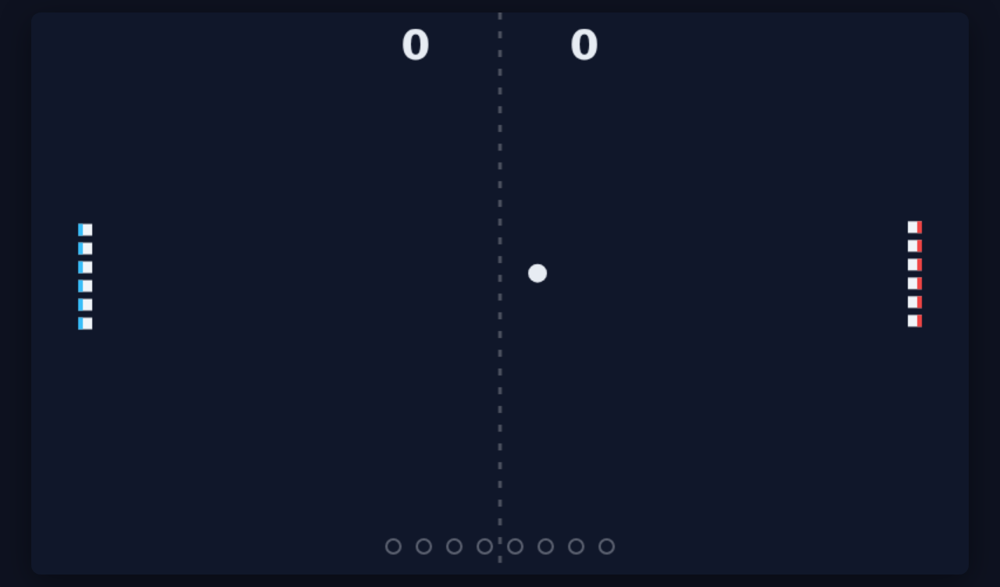

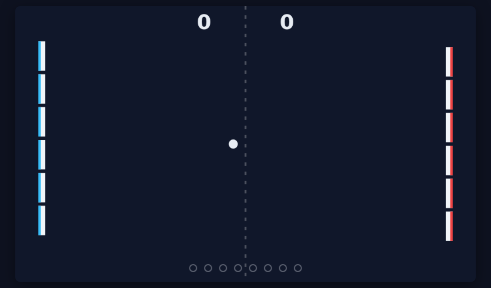

## paddle.outOfBody

- Generations evaluated: 4
- Starting trial id: paddle-outOfBody
- Starting average fun score: 0.543
- Best trial id: paddle-outOfBody.1.2.2.1.3.3
- Average fun score (best trial): 0.641
- Fun score improvement: 0.098 (18.1%)

| Parameter | Before | After |
| --- | --- | --- |
| paddleOpacity | 0.2 | 0.2 |
| trailLength | 6 | 4 |
| sampleInterval | 0.05 | 0.045 |
| trailFade | 0.7 | 0.7 |
| paddleSizeMultiplier | 1 | 2 |

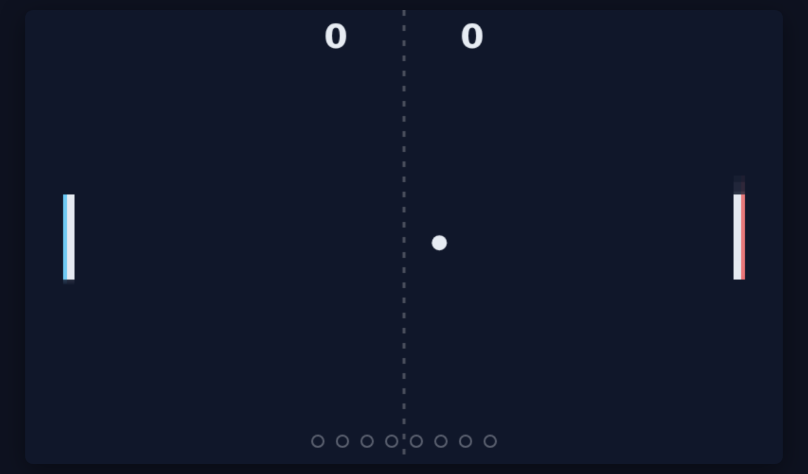

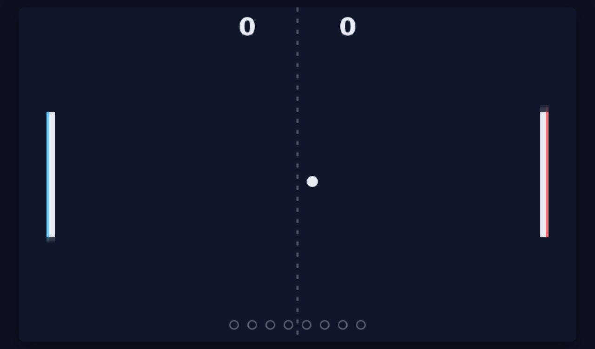

## paddle.slinky

- Generations evaluated: 4
- Starting trial id: paddle-slinky
- Starting average fun score: 0.612
- Best trial id: paddle-slinky.1.1.2.1.3.1
- Average fun score (best trial): 0.695
- Fun score improvement: 0.082 (13.5%)

| Parameter | Before | After |
| --- | --- | --- |
| paddleSizeMultiplier | 1 | 3.75 |
| flopRate | 2.6 | 2.6 |

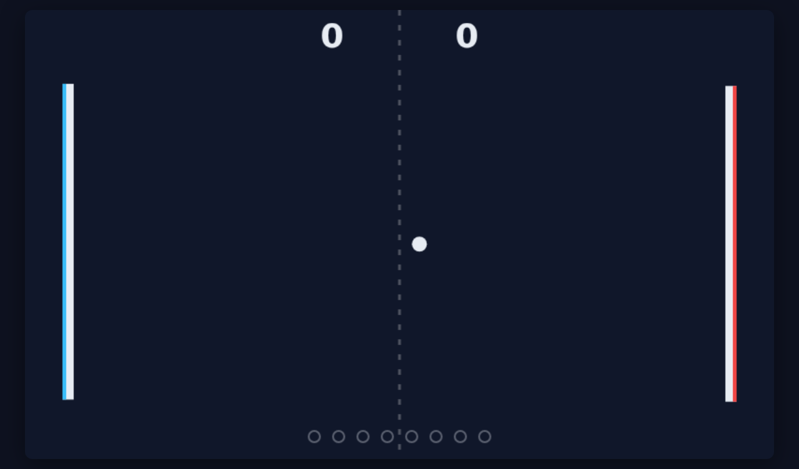

